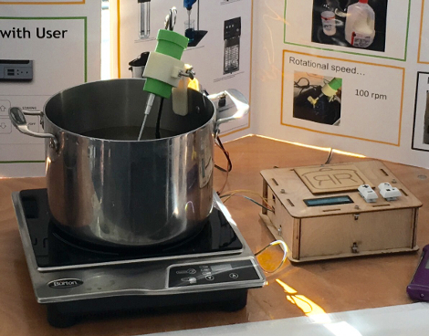

## Induction Heating Control with Digital Temperature Probe

A Sous-Vide alternative.

# Prototype, the "Sous Chef"

Hardware devices:
* Max Burton 6200 induction cooktop
* DS18B20 Temperature Probe

PID constants are for our prototype; you may need to tune them for your system.
